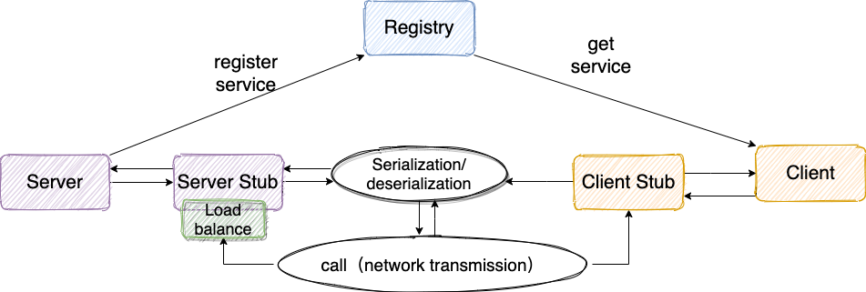

# K-RPC

About A custom RPC framework implemented by Netty+Kyro+Zookeeper.（一款基于 Netty+Kyro+Zookeeper 实现的自定义 RPC 框架）

# 技术栈

- 序列化框架：Hession2、Kyro、Protostuff
- Java 代理机制 
  - 静态代理：代理模式
  - JDK/CGLIB 动态代理
- 线程池：CompletableFuture
- 网络通信：Socket、Netty
- 服务注册中心：Zookeeper 
  - 客户端框架：Curator

# 项目内容

1. 服务注册和服务发现
2. 简单 RPC 框架的实现，包括序列化、反序列化、网络通信等基本机制
3. 封装报文，解析报文，报文的编码器和解码器
4. 负载均衡的实现，包括轮询、随机策略
5. 测试框架，用于编写和运行测试用例，以测试 RPC 框架的正确性
6. 压缩消息体积

